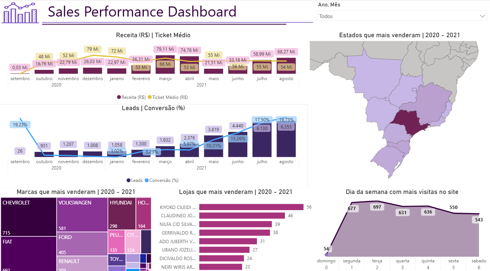
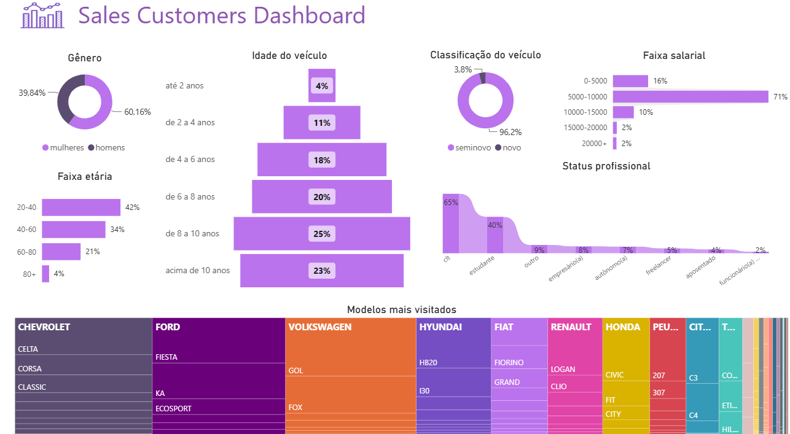

# Sales Analytics Dashboard 📊

Projeto de análise de dados desenvolvido utilizando **PostgreSQL, SQL e Power BI**, com foco na criação de indicadores comerciais e geração de insights através de dashboards interativos.

O projeto foi desenvolvido durante o curso de **SQL para Análise de Dados**, aplicando conceitos de consultas SQL, exploração de dados e Business Intelligence.

---

## 🎯 Objetivo do Projeto

Realizar uma análise de dados de vendas e clientes, transformando dados brutos em informações estratégicas para acompanhamento de desempenho comercial e entendimento do perfil dos consumidores.

---

## 🛠️ Tecnologias Utilizadas

- PostgreSQL
- SQL
- Power BI
- DAX

---

## 📌 Etapas do Projeto

- Exploração dos dados utilizando SQL
- Criação de queries analíticas em PostgreSQL
- Tratamento e organização dos dados
- Construção de indicadores de negócio
- Modelagem dos dados no Power BI
- Desenvolvimento de dashboards interativos

---

# 📊 Dashboard 1 - Sales Performance

Dashboard desenvolvido para análise da **performance de vendas**, acompanhamento de indicadores comerciais e evolução dos resultados.

### Principais insights:

1. Evolução de Receita e Ticket Médio: A receita atingiu seus maiores picos entre março e abril de 2021 (~R$ 75Mi–79Mi), mas apresentou desaceleração em maio–junho; já o ticket médio caiu de R$ 79Mi (dez/20) para a faixa de R$ 54Mi–56Mi em 2021, sinalizando vendas com valor unitário menor no período recente.

2. Crescimento Consistente de Leads e Conversão: A captação de leads subiu de forma contínua em 2021, saltando de ~1.000 em jan/21 para 6.353 em agosto/21, acompanhada por uma taxa de conversão que atingiu seu ápice de 19,73%.

3. Concentração Geográfica: São Paulo é o estado líder disparado em vendas (destacado no tom mais escuro do mapa), seguido pelos demais estados das regiões Sudeste, Sul e Centro-Oeste.

4. Marcas e Lojas de Maior Desempenho: Chevrolet (715), Fiat (692) e Volkswagen (581) são as marcas campeãs de vendas no período (2020–2021); entre as lojas/vendedores, o topo é liderado por Kiyoko Cileidi (56) e Claudineo Jo... (46).

5. Insight de Tráfego e Negócio: O tráfego do site é focado em dias úteis, com terça-feira (697) e segunda-feira (677) como os dias de maior visitação, caindo vertiginosamente no domingo (54). As ações comerciais e de tráfego pago devem focar no início da semana no estado de SP.



---

# 👥 Dashboard 2 - Customer Profile

Dashboard desenvolvido para análise do **perfil dos clientes**, buscando compreender características da base e identificar padrões de comportamento.

### Principais insights:

1. Perfil Principal: O cliente ideal é uma mulher (60%), de 20 a 40 anos (42%), contratada via CLT (65%).

2. Renda Familiar: A grande maioria (71%) ganha entre R$ 5.000 e R$ 10.000, o que define um poder de compra focado na classe média.

3. Domínio Absoluto de Seminovos: 96,2% procuram por seminovos, com forte preferência por veículos com mais de 6 anos de uso (68% do total).

4. Modelos e Marcas Mais Buscados: Chevrolet, Ford e Volkswagen lideram o interesse, com foco total em carros populares e de manutenção acessível (Celta, Corsa, Gol, Fiesta, Ka, HB20).

5. Insight de Negócio: O estoque e o marketing devem ser direcionados para hatches/compactos seminovos de 2014 a 2020, casados com opções de financiamento acessíveis para renda de até R$ 10 mil e comunicação focada no público feminino.



---

## 📂 Estrutura do Projeto

```
Sales-Analytics-Dashboard

├── README.md
├── dashboard.png
├── dashboard_2.png
├── queries_customers.sql
├── queries_sales.sql
├── sales_performance_dashboard.pbix
└── sales_customers_dashboard.pbix
```

---

## 📈 Conclusão

O projeto permitiu aplicar conceitos de **SQL, análise de dados e Business Intelligence**, transformando dados em informações estratégicas através de dashboards interativos.

---

**Tecnologias:** PostgreSQL | SQL | Power BI | DAX
